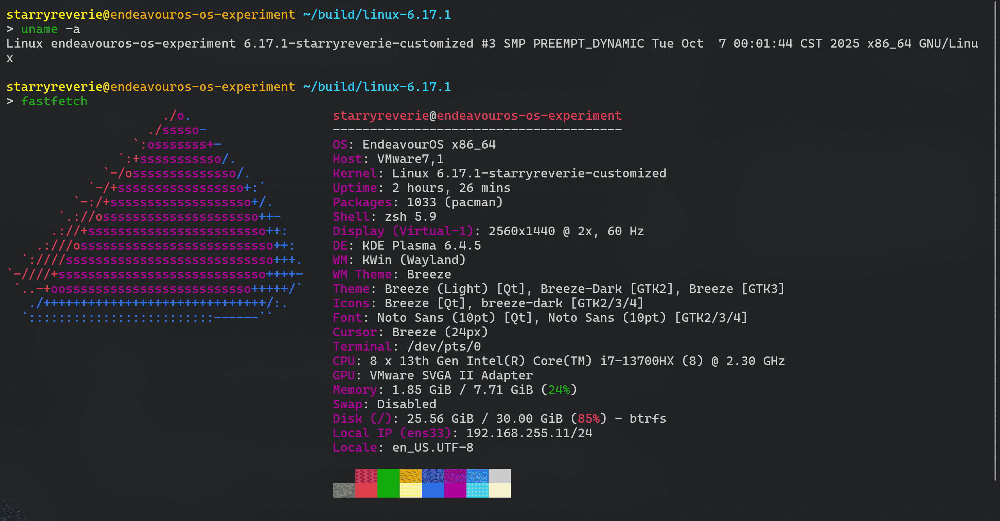

简单记录一下在 EndeavourOS 上手动编译 Linux 内核的过程。

### 环境准备

整个过程在虚拟机上完成，具体配置参数如下：

- Hypervisor: VMware Workstation Pro 17
- OS: EndeavourOS Mercury Neo
- Bootloader: systemd-boot
- Old Kernel: 6.16.8-arch3-1
- New Kernel: 6.17.1
- CPU: 8 x 13th Gen Intel(R) Core(TM) i7-13700HX @ 2.30 GHz
- RAM: 8 GB
- IP：VMnet8 (NAT) 192.168.255.11

为了操作方便，通过 SSH 从宿主机连接到虚拟机，运行以下命令连接，其中 `starryreverie` 为已创建用户：

```bash
ssh starryreverie@192.168.255.11
```

### 获取内核源码

内核源码可以从 [kernel.org](https://www.kernel.org/) 下载。选择 `linux-6.17.1.tar.xz` 源码包，并使用以下命令下载：

```bash
wget https://cdn.kernel.org/pub/linux/kernel/v6.x/linux-6.17.1.tar.xz
```

在本地新建目录 `build`，并解压源码包：

```bash
mkdir build
tar -xvf linux-6.17.1.tar.xz -C build
```

进入源码目录并查看目录：

```bash
cd build/linux-6.17.1
ls -alh
```

### 配置编译环境

在编译内核前，需要安装必要的工具和依赖包。使用以下命令安装：

```bash
sudo pacman -Syu
sudo pacman -S base-devel ncurses bc kmod cpio flex bison libelf-dev openssl
```

### 编译内核

在配置前，清理内核源代码目录，运行以下命令：

```bash
make mrproper
```

内核的配置选项实在太多，而且想要在现在的机器上正常跑起来，需要额外启用很多选项，而默认的编译选项是远远不够的。所有我们要获取当前系统的内核编译配置，其以 gzip 格式压缩并保存在 `/proc/config.gz` 文件中：

```bash
zcat /proc/config.gz > .config
```

运行 `make nconfig` 命令，进入内核配置界面：

```bash
make nconfig
```

在这里我做了两个定制操作。第一个是定制我们的内核的版本号，以便区分自己构建的内核和原来自带的，需要在 `General setup` 中启用 `Local version - append to kernel release` 选项，并设置为 `-starryreverie-customized`。另外一个是关闭休眠功能，在虚拟机里显然是几乎用不到休眠的，这里选择 `Power management and ACPI options`，关闭 `Hibernation (aka 'suspend to disk')`。完成后保存并退出。

做完定制化，就可以开始编译内核了，使用以下命令：

```bash
make -j8 bzImage
make -j8 modules
```

内核的构建产物位于 `./arch/x86/boot/bzImage`。

### 安装

先安装内核模块：

```bash
sudo make modules_install
```

由于我安装系统选择了使用 `systemd-boot` 作为引导程序，所以安装内核步骤与使用 `GRUB 2` 的不同。`systemd-boot` 读取位于 `/efi/loader/entries` 目录下的配置文件，并根据这些配置文件加载相应的内核。为了让 `systemd-boot` 可以在引导时找到内核，需要把内核和 initramfs 文件复制到 EFI 系统分区。

先在 `/efi` 下创建目录用于存放内核文件，然后复制之前的构建产物到这里，最后生成 initramfs：

```bash
sudo mkdir /efi/6.17.1-starryreverie-customized
sudo cp arch/x86/boot/bzImage /efi/6.17.1-starryreverie-customized/linux
sudo mkinitcpio -k /efi/6.17.1-starryreverie-customized/linux -g /efi/6.17.1-starryreverie-customized/initrd
```

接下来在 `/efi/loader/entries` 目录下创建一个新的 `systemd-boot` 配置文件 `6.17.1-starryreverie-customized.conf`，内容如下：

```plain
title      EndeavourOS (StarryReverie Customized)
version    6.17.1-starryreverie-customized
sort-key   6.17.1-starryreverie-customized
options    nvme_load=YES nowatchdog rw rootflags=subvol=/@ root=UUID=6b58345d-51e6-4e32-ba4d-9d2ed4e6732c systemd.machine_id=b50bb39cc7db4e13898771b4bc62ea17
linux      /6.17.1-starryreverie-customized/linux
initrd     /6.17.1-starryreverie-customized/initrd
```

重启系统后，不出意料的话，在 `systemd-boot` 菜单中就可以看到新内核选项了。选择新内核启动，进入系统后，使用 `uname -r` 命令验证当前运行的内核版本，显示为 `6.17.1-starryreverie-customized`，说明新编译的内核已成功加载。

按照传统，是要展示一下 Fetch Information 的：


